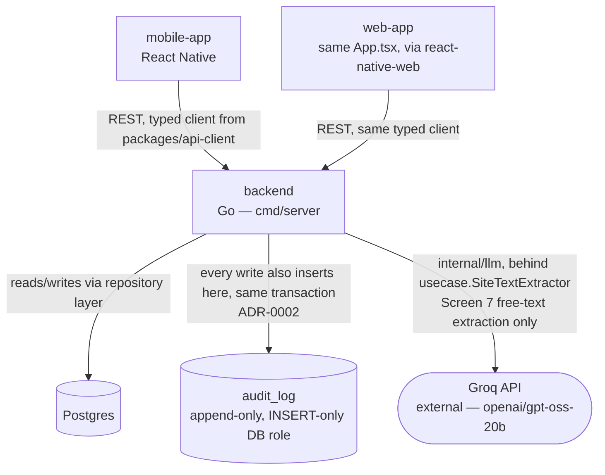
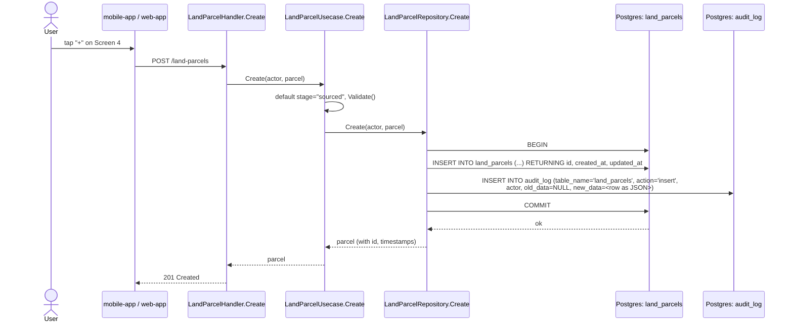
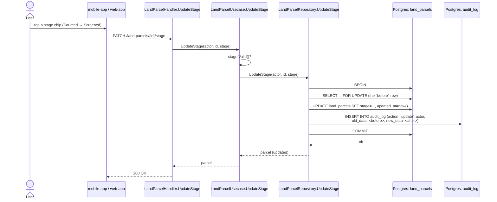

# System Architecture

This diagram is source of truth for the shape of the system — update it when a real container
(app, service, database) is added or removed, not when implementation details change inside one.

## Container diagram

The cylinder shape is the standard convention for "this is a data store," not a stylistic choice
— any engineer reading this diagram for the first time knows `DB` and `Audit` are databases
without needing a legend. The stadium shape on `Groq` marks it as an external service call, not
something this repo owns or can guarantee the uptime of — if a second external AI provider or any
other third-party API is ever added, use the same shape so "things we don't control" stay visually
distinct from our own containers at a glance.

Notice `mobile-app` and `web-app` both point at the *same* backend through the *same* generated
client (ADR-0003) — if this diagram ever shows two different boxes for "mobile API" and "web
API," that's a sign the architecture drifted from the decision and needs a new ADR explaining
why, not a silent change.

## Sequence diagrams — the real, verified Land Parcels flow

These replace an earlier version of this file that diagrammed a hypothetical future feature
(engineer draft sign-off) that didn't exist in the code. Per "keeping this file honest" below,
that was already wrong the day it was written — these two diagrams instead trace the actual
`internal/handler/land_parcel.go` → `internal/usecase/land_parcel.go` →
`internal/repository/postgres/land_parcel.go` call chain, verified against a real Postgres on
2026-09-15 (see the "Status" section at the bottom).

**Create — the insert path.** No prior row exists, so `old_data` is `NULL`.

**Stage update — the update path.** The repository reads the current row under `FOR UPDATE`
*inside* the same transaction as the write, so the `before` snapshot in `audit_log.old_data` is
guaranteed consistent with what's actually being replaced — not a separate, potentially stale read.

Both diagrams show the same structural fact: the `Audit` insert happens inside `Repo`, in the
same transaction as the real write, never inside `API` or `UC` — a new mutable entity gets this
for free the moment its repository follows the same "write + audit, same transaction" shape,
without anyone needing to remember to call a logging function.

**The original version of this file's very first sequence diagram**, before it was replaced for
being hypothetical (see the note above), imagined exactly this: an engineer signing a cost-
incurred draft. As of 2026-09-15 that flow is real —
`CertificationPacketUsecase.SignEngineerDraft` (Screen 8.4.1's "Approve & Sign"), same
write-in-`Repo`-same-transaction shape, verified live with a real signature (`A. Mehta (Engineer)`)
producing a real `audit_log` row. Not re-diagrammed here in full to avoid this file ballooning
into one sequence diagram per entity — the two above already establish the pattern every
subsequent entity follows identically.

## Status — what's actually verified, not just designed

As of 2026-09-15, **eight entities** are built and verified end-to-end against a real Postgres +
real HTTP calls (not just designed): `Project`, `LandParcel`, `FeasibilityAssessment`,
`LegalCheck`, `GovernmentApproval`/`ApprovalPlaybook` (with a real Groq LLM call, see the `Groq`
node above), `LandTenure`, `FinancialStructure`, `EscrowAccount`, `CertificationPacket`. Each
followed the same pattern the two diagrams above establish. Specifics live in
`docs/domain-model.md` and the session's own memory notes, not duplicated here.

- The ADR-0002 guarantee was tested directly at the database role level, not just read in the
  migration SQL: connected *as* `scridddhub_app` and confirmed it can `INSERT` into `audit_log`
  but gets `permission denied` on `UPDATE` and `DELETE` against that same table.
- Two non-negotiable constraints from `docs/domain-model.md` are now enforced in code, verified
  live including their refusal paths: `EscrowAccount`'s bank balance can only be written by a
  separate, non-mobile-app endpoint (`UpdateBankFeed`, audited under a distinct
  `bank-integration` actor); `ArchitectCertificate` cannot be certified without a recorded site
  visit (`CertifyArchitect` returns a real 400 otherwise).
- Not yet done: no screen in the mobile app uses the real Stitch design tokens' font families
  (Plus Jakarta Sans/Inter/Public Sans) yet — colors are real, fonts are still system default. No
  device/emulator visual check has been done for any screen — deliberately deferred until all of
  Level 1 is built (two real Android emulators are available on this machine when that happens).

## Keeping this file honest

- If a new container (a service, a queue, a cache) gets added, it goes in this diagram before
  or alongside the code that introduces it — not as an afterthought.
- If this diagram and the actual code disagree, the diagram is wrong and gets fixed immediately
  — a stale diagram is worse than no diagram, since it actively misleads the next reader.
