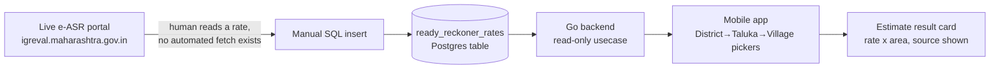
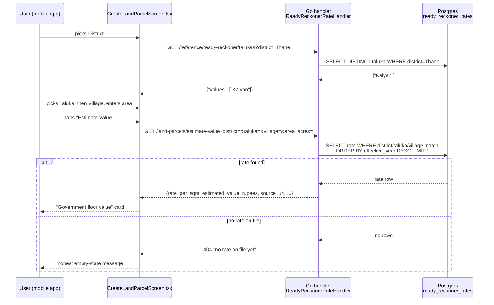
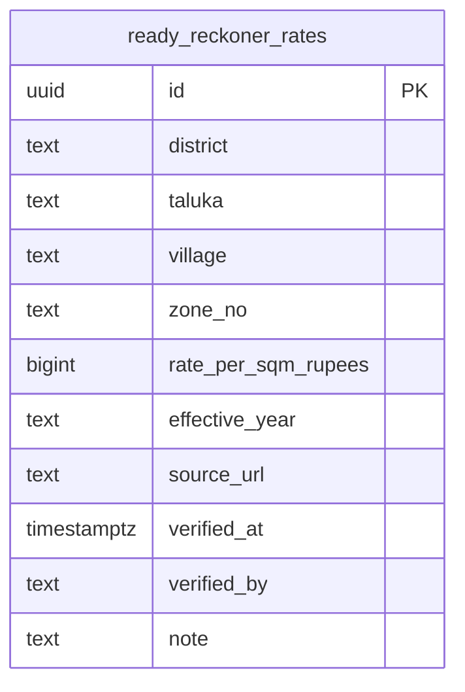
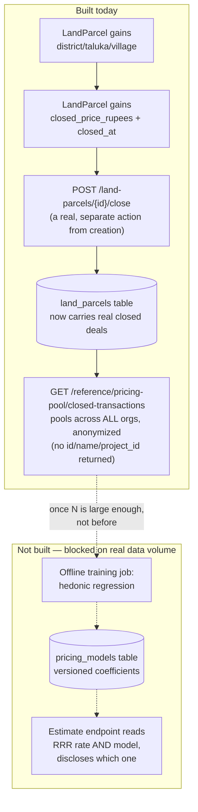
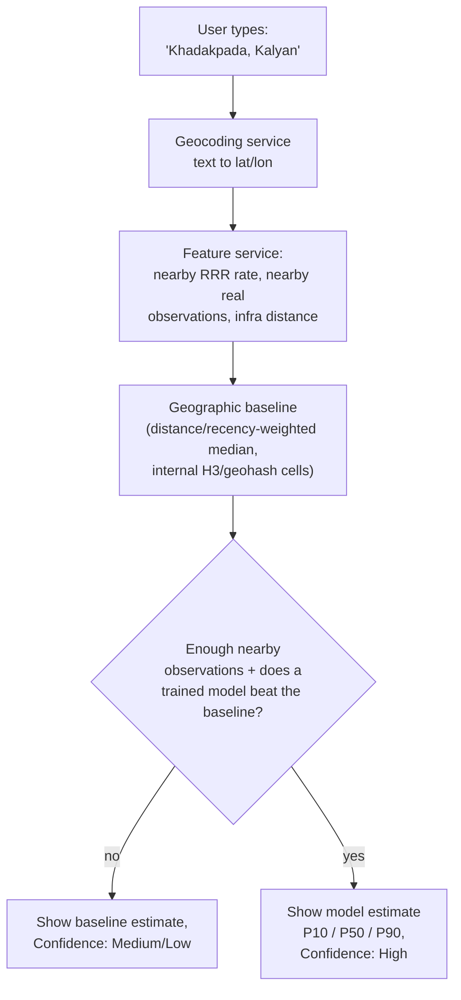

# Estimated Parcel Value

Feature owner: Land Parcels (Level 1 Planning), "Just checking a location" flow (Screen 4.2).

---

## Part 1 — Product (non-technical)

### What problem this solves

Someone scouting land for a future project often doesn't have a price yet — no broker quote, no
listing, nothing formal. Before this feature, the only option was to leave the price blank. Now
they can pick a location (District → Taluka → Village) and an area, and get back a real,
government-sourced number instead of nothing.

### What it deliberately is NOT

Two earlier ideas were tried and explicitly rejected — worth knowing so nobody re-suggests them:

1. **Comparing against other parcels already in the app.** The first version of this feature
   worked this way, and it was wrong: a builder's very first parcel would have nothing to compare
   against, and the number would depend on what data this app happened to have, not on what the
   land is actually worth. Rejected outright, recorded as
   [ADR-0004](../../docs/adr/0004-parcel-estimate-is-location-based-not-comparable-based.md).
2. **Asking an AI to guess a price from its training knowledge, or to search the web live.** That's
   a plausible-sounding guess dressed up as a fact. Real valuation tools (Zillow, HouseCanary,
   Redfin) don't do this either — see References below.

What it actually does: look up the government's own published land rate for that exact village,
and multiply by the area. Nothing else goes into the number.

### The one honest limitation, in plain terms

The number you get back today is the **government's legal minimum rate** (used to calculate stamp
duty), not what the land would actually sell for. In fast-growing areas these two can differ by a
lot — our own first real test came back **35x below** a real asking price for a similarly-sized
parcel. So the card is explicitly labeled **"Government floor value (stamp-duty basis)"**, with a
warning, rather than "Estimated market value" — because that would be a false promise right now.
Closing that gap for real (an actual market-calibrated estimate) is future work, not done.

### Current state, in plain terms

- The feature works end-to-end, but only for **one village so far**: Kakadapada, Kalyan, Thane —
  seeded from a real number the user read off the government's live rate-lookup site.
- Every other village will 404 with an honest "no rate on file yet" message until someone looks it
  up on the government site and it gets added — there's no automatic way to fetch it yet (see
  Part 3).
- Scope is Maharashtra only, for now — see References for why.
- **Direction change (2026-09-20, ADR-0006)**: picking District → Taluka → Village manually is a
  fallback, not the target experience. The actual goal is "type a location, get a price" — which
  means splitting *finding the location* (a geocoding problem) from *pricing it* (a valuation
  problem). See Part 3's "Refined architecture" section — this is a real re-architecture, not yet
  built, and it doesn't itself solve the still-open question of where real market-price data comes
  from at volume.

---

## Part 2 — References

**Ready Reckoner Rate (RRR)**, formally the Annual Statement of Rates (ASR): published every year
by Maharashtra's Department of Registration & Stamps (IGR), effective 1 April, for every village/
zone/survey-number in the state. It is the government's own assessed minimum fair market value,
used for stamp duty calculation — a real legal instrument, not a market estimate.

- Official portal: [igrmaharashtra.gov.in](https://igrmaharashtra.gov.in/Home/asr_about) — "e-ASR"
  under the Stamps section.
- Per-district lookup tool: [igreval.maharashtra.gov.in/eASR2.0](https://igreval.maharashtra.gov.in/eASR2.0/eASRCommon.aspx?hDistName=Pune) —
  confirmed (via a direct fetch attempt) to be an interactive district → taluka → village form,
  not a public API. This is why every rate in our database is entered by hand, not scraped.
- Set annually by the IGR, effective April 1 each year ([Business Standard](https://www.business-standard.com/amp/article/economy-policy/maha-to-revise-ready-reckoner-rates-from-april-1-115123100855_1.html)).

**How real AVMs (Zillow/HouseCanary/Redfin-class tools) actually work** — confirmed via research,
not assumed, because this shaped our whole approach:

- They estimate value in seconds using statistical/ML models (hedonic pricing, repeat sales)
  trained on large historical datasets — [HouseCanary](https://www.housecanary.com/blog/automated-valuation-model),
  [Redfin](https://www.redfin.com/blog/automated-valuation-model/).
- The data behind them is licensed and continuously updated on a schedule (MLS listings, county
  tax assessor records), **not fetched live per query** — [Bankrate](https://www.bankrate.com/real-estate/automated-valuation-model-avm/).
- Land-specific automated valuation is itself an established research area, not something being
  invented from scratch here — [ScienceDirect: automated land valuation models](https://www.sciencedirect.com/science/article/pii/S0264275124003299).

The implication: build a small version of the same shape — **ingest → structure → compute** —
rather than shortcutting the ingestion step with an AI call.

**Scope decision — Maharashtra first**: RRR is Maharashtra-specific. Other states publish an
equivalent (circle rate / guideline value / DLC rate) under different names, each with its own
portal and format. Expanding beyond Maharashtra is a separate, later decision.

---

## Part 3 — Development (technical)

### Pipeline shape

The ingestion side (portal → database) is manual today — a human looks up one village's rate and
it gets inserted with `source_url`/`verified_by`/`verified_at`. The serving side (database →
mobile app) is fully automatic and real-time.

### Request flow — getting an estimate

Nothing in this path calls an LLM, the internet, or any other parcel's data — the only external
input is whatever is already sitting in our own `ready_reckoner_rates` table.

### Data model

One row = one government-published rate for one village/zone/year. `UNIQUE(district, taluka,
village, zone_no, effective_year)` — a new year's rate is a new row, not an overwrite, so history
is never lost.

### Code map

| Layer | File | What it does |
|---|---|---|
| Migration | `backend/migrations/000024_create_ready_reckoner_rates.*.sql` | Creates the table |
| Domain | `backend/internal/domain/ready_reckoner_rate.go` | `ReadyReckonerRate` struct, `EstimateLocationValue()` (rate × area, no FSI multiplier) |
| Usecase | `backend/internal/usecase/ready_reckoner_rate.go` | `EstimateParcelValueUsecase` — read-only, no Create method exposed to the app |
| Repository | `backend/internal/repository/postgres/ready_reckoner_rate.go` | Real SQL: `Get`, `ListDistricts`, `ListTalukas`, `ListVillages` |
| Handler | `backend/internal/handler/ready_reckoner_rate.go` | 4 HTTP endpoints, honest 404 on no match |
| Routes | `backend/cmd/server/main.go` | Wires it all together |
| Mobile | `mobile-app/src/screens/CreateLandParcelScreen.tsx` | `PickerField` component, cascading District/Taluka/Village, result card |
| Migration (pooling prereqs) | `backend/migrations/000025_land_parcel_structured_location_and_closed_price.*.sql` | Adds `district`/`taluka`/`village`/`closed_price_rupees`/`closed_at` to `land_parcels` |
| Domain | `backend/internal/domain/closed_transaction.go` | `ClosedTransaction` — anonymized, no org/project/parcel identity |
| Usecase/Repo (pooling) | `backend/internal/usecase/pricing_pool.go`, `backend/internal/repository/postgres/pricing_pool.go` | `ListClosedTransactions` — no project_id parameter anywhere in this path |
| Handler (pooling) | `backend/internal/handler/pricing_pool.go` | `GET /reference/pricing-pool/closed-transactions` |
| Handler (close) | `backend/internal/handler/land_parcel.go` (`RecordClosedPrice`) | `POST /land-parcels/{id}/close` |
| Migration (geography) | `backend/migrations/000026_create_maharashtra_geography.*.sql` | `mh_districts`/`mh_talukas`/`mh_villages` — the real, complete Maharashtra directory |
| Seed loader | `backend/cmd/seed_mh_geography/main.go` | One-off loader from `pipeline/raw_data/*.json` into the geography tables |
| Usecase/Repo/Handler (geography) | `backend/internal/{usecase,repository/postgres,handler}/geography.go` | `GET /reference/geography/{districts,talukas,villages}` — replaces the old rate-scoped picker endpoints |

The old comparable-based `PriceEstimate`/`EstimatePrice` (domain/usecase/handler/route) was fully
deleted, not left running alongside the new one.

### What's verified, and what isn't

**Verified live** (not just "compiles"):
- Inserted a clearly-marked TEST row (50,000 ₹/m², 2 acres) via direct SQL, hit all 4 endpoints for
  real, confirmed the math by hand exactly (₹40,46,85,642), deleted the test row.
- Seeded one real row (Kakadapada, Kalyan, Thane — ₹520/m², from the live portal) and walked the
  full picker chain on the real Android emulator: District → Taluka → Village auto-narrowed
  correctly, Area accepted, Estimate Value returned the real ₹0.53 Cr figure with the correct
  "Government floor value" framing, source link, and verified date.
- `go build`/`go vet`/`tsc --noEmit`/`jest`/`web:build` all clean.

**Not done — real remaining work, not polish**:
- Only one village has a real rate. Every other village 404s until manually seeded.
- No location-matching for free text — the mobile UI sidesteps this by using structured pickers
  instead, which only works once real village names exist in the table.
- No market-calibration layer — the floor-vs-market gap is disclosed, not solved.
- `zone_no` exists in the schema but isn't surfaced in the picker UI yet (fine for villages with
  one rate, a gap for villages with a per-zone split).

### Toward a real ML model (2026-09-19) — why the RRR lookup alone can never become one

The user pushed on this directly: we should actually build toward the HouseCanary/Redfin-class
model described in Part 2, not stop at a government lookup table. Here's the honest technical
reasoning for why that's a bigger, separate effort — and what's now built toward it.

**A hedonic pricing model needs price *variance* to learn from.** `ready_reckoner_rates` is one
fixed number per village per year — every parcel in the same village gets the identical rate. You
cannot train a regression on a constant; there is nothing for it to find a pattern in. Real AVMs
work because they see many *different* sale prices for *different* properties in the same area and
learn what explains the difference (area, road access, date, ...).

**We checked Maharashtra's second public data source specifically for this** — Index-II, the
government's registered-transaction search
([freesearchigrservice.maharashtra.gov.in](https://freesearchigrservice.maharashtra.gov.in/)),
which is the real analog to the "county tax assessor records" that power US AVMs. Confirmed by a
direct fetch: **it requires already knowing a specific survey/property number** — no date-range
search, no list-by-village, no bulk export. It can verify one transaction you already know about;
it cannot help you discover unknown ones. This is a genuine, structural gap in India's public land
records, not a tooling failure on our side — it's the reason commercial aggregators (PropEquity,
Zapkey, 99acres, Housing.com) exist as businesses: assembling this data is the hard, valuable part.

**Decision, recorded as [ADR-0005](../../docs/adr/0005-pooled-cross-org-transactions-for-future-pricing-model.md)**:
build the training dataset organically, from real closed deals entered by this app's own users —
**pooled and anonymized across every org**, never scoped to one project (that would just be
ADR-0004's rejected idea again). The critical distinction: an offline-trained, versioned model
built from many orgs' pooled real transactions is the same shape as Zillow training on everyone's
MLS data — not a live "check your neighbor's asking price" lookup. And the data point that matters
is a deal's **final closed price**, never the initial asking price (`cost_rupees`), which is
untrusted and never re-verified — using it as ground truth would repeat the exact floor-vs-market
mistake this feature already made once with the RRR rate.

#### What's built now (infrastructure only — no model yet, there's no data to train on)

- `LandParcel.District/Taluka/Village` — structured location, populated whenever known (the "Just
  checking a location" flow already collects these via the Ready Reckoner picker; the "I have a
  price" flow still only has free-text `Location`, so those parcels can't be pooled by village yet
  — a real, acknowledged gap, not silently papered over).
- `LandParcel.ClosedPriceRupees`/`ClosedAt` + `POST /land-parcels/{id}/close` — records a real
  closing price as its own event, distinct from the original asking price. Deliberately not wired
  to any mobile UI button yet (same "built for a future consumer" pattern as `EscrowAccount`'s
  bank-feed endpoint) — there's no "mark as sold" screen yet, just the real backend capability.
- `GET /reference/pricing-pool/closed-transactions?district=&taluka=&village=` — pools real closed
  deals **across every project/org in the database**, no project_id parameter exists on this route
  at all. Returns only `area_acres`/`closed_price_rupees`/`closed_at` — no id, name, or project
  reference, so it cannot be used to re-identify a specific deal or org.
- **Verified live, full loop**: created a TEST parcel with `district/taluka/village` set, called
  `/close` on it with a real price, confirmed it appeared correctly in the pooled query (anonymized
  fields only), confirmed both the create and close actions produced real `audit_log` rows, then
  deleted the test parcel.

#### What happens once real data exists (not yet — this is the plan, not the build)

1. **Volume gate.** No model is trained below a real minimum sample size (tens, not a handful) per
   village/region being modeled. Below that, the estimate stays exactly what it is today — the
   plain RRR floor value, honestly labeled. Training on too little data isn't a smaller version of
   a real model, it's overfitting dressed up as one — the same category of dishonesty this project
   has rejected everywhere else.
2. **Model family: start with a simple, interpretable hedonic regression** (ordinary least
   squares), not deep learning. Something like
   `price_per_sqm ~ rrr_rate + area + fsi + village + time_trend`. Interpretable coefficients mean a
   human can actually look at what the model learned before trusting it — matching this project's
   "AI drafts, human decides" discipline even for a statistical model. Only move to gradient-boosted
   trees (XGBoost/LightGBM) later, if data volume and real nonlinearity justify the added opacity.
3. **Versioned, disclosed model artifacts.** A small `pricing_models` table: version, trained_at,
   sample_size, coefficients (JSON), the data snapshot it was trained on. Every model-backed
   estimate response names which model version produced it — never a black-box number, the same
   transparency the RRR rate already has (source_url, effective_year, verified_at).
4. **Lightweight serving, no new infra.** If the model stays a linear regression, scoring it is
   just a dot product of stored coefficients against input features — computed directly in Go, no
   separate model-serving service needed. Only reconsider this if/when a nonlinear model family
   actually becomes justified by data volume.
5. **Repeat-sales indexing** (tracking the same parcel/zone's price change across multiple sale
   events over time) is a real refinement for trend-adjustment, but needs the same parcel to sell
   more than once — realistically deferred well past the first working regression.

### Refined architecture (2026-09-20): separating location search from valuation — ADR-0006

The plan above (Section "Toward a real ML model") treated location-matching and valuation as one
problem, solved by cascading District/Taluka/Village pickers. That's why every new village needs
manual seeding before anything works. **[ADR-0006](../../docs/adr/0006-location-search-separated-from-valuation-model.md)**
re-architects this: location resolution (geocoding free text to coordinates) and valuation
(pricing at those coordinates) are split into two independent problems, closing the
free-text-matching gap that every earlier version of this doc flagged as unsolved.

**Key rules from ADR-0006, restated concretely:**
- District/Taluka/Village pickers become a *fallback/manual-entry path*, not the primary input —
  the primary path is a location search box, once geocoding is wired in (not built yet).
- **Land type scope narrows to residential land/plots only** for the first working version —
  agricultural, commercial, and industrial land are genuinely different value drivers at the same
  coordinates and must not be mixed into one model.
- A **simple geographic baseline must exist and be beaten before any ML model ships** — this is
  now the actual Phase 1 target, replacing the earlier "start with OLS regression" framing (still
  reasonable *after* the baseline, not instead of it).
- Validation must split by **geography and time**, never randomly — spatial/temporal
  autocorrelation would otherwise make accuracy look artificially good.
- **Google Places/Geocoding is a paid, metered service** — using it at real volume needs an
  explicit Google Cloud billing decision, the same category of vendor/cost call as the commercial
  land-data licensing option already declined once. **Not yet decided.**

#### Master market-observation schema (proposed, not yet built)

```mermaid
erDiagram
    market_observations {
        uuid observation_id PK
        text source
        text source_listing_id
        double latitude
        double longitude
        text raw_address
        text locality
        text land_type "residential_plot only, for v1"
        double plot_area_sqft
        bigint asking_price_rupees
        bigint price_per_sqft_rupees
        date listing_date
        date collected_date
        text seller_type
        text rera_id
        bigint ready_reckoner_rate_rupees
        text geocoding_accuracy
        text source_quality
    }
```

One row = one real market observation (a listing, not necessarily a closed sale — see the source
matrix below for which sources give which). This is a new, separate concept from
`land_parcels.closed_price_rupees` (ADR-0005) — that captures *our own users'* real closed deals;
`market_observations` would capture *externally observed* market listings at volume. Both are
legitimate inputs to a future baseline/model; neither exists with real rows yet.

#### Source-viability matrix — hands-on checked, not assumed

| Source | Price | Area | Lat/lon | Date | Access status (verified this session) |
|---|---|---|---|---|---|
| MahaRERA (project list) | — | — | — | ✓ (`Last Modified`) | List-search by district **confirmed real and working** (49,450 projects) — but this is registration/status metadata, not sale price. |
| MahaRERA (project detail) | ? | ? | — | — | **Unresolved** — detail page hit a real `single-spa` bug (`error code 41`, "loaded multiple times") that prevented content from rendering; unconfirmed whether unit-wise pricing exists there at all even if the bug is fixed. |
| Index-II (registered transactions) | ✓ (if known) | ✓ (if known) | — | ✓ | Real, government, transacted prices — but requires **already knowing** the survey/document number. Can verify a specific known deal, cannot discover unknown ones in bulk. |
| Ready Reckoner Rate | (floor only) | n/a | — | ✓ (effective year) | Already integrated (Part 3 above) — a baseline feature, never a price label (no variance). |
| Government e-auctions (bank NPA/SARFAESI) | ✓ (if published) | ✓ | — | ✓ | Not yet checked hands-on. Small volume, but genuinely real, verifiable sale prices when published. |

**Honest summary of where this leaves us**: the actual bottleneck — real, varying-price
observations at volume, legally obtainable — is still unsolved. MagicBricks has the best data
shape but a real compliance blocker; MahaRERA's list side works but doesn't carry price; nothing
else has been hands-on verified yet. This table is the concrete next thing to fill in, not
theoretical — each unchecked row needs the same real investigation MagicBricks and MahaRERA got
before being trusted either way.

#### Confidence tiering (design, not built)

Every estimate should disclose **High / Medium / Low** confidence based on real observation
density and recency near that location — never a fabricated "High" just because a model returned
a number. Exact thresholds (how many observations, how recent, within what radius count as
"High") are not yet decided — this needs a real number the same way the model volume gate does.

#### First real Stage 1 build (2026-09-20): the canonical Maharashtra geography table

The very first piece of the plan above — Mahavillages/geography backbone — is now real, not
theoretical. Found and verified Maharashtra's own **public, government-run "Common Village
Master" API** (`http://115.124.105.220/API/...`, run by the Department of Land Records) — a real,
documented, currently-live API returning clean JSON, no scraping or WAF issue of any kind. Fetched
and loaded the whole state:

- **36 districts, 358 talukas, 44,918 villages** — verified live against the government's own
  published figures (exact match). Raw JSON snapshots kept at `pipeline/raw_data/*.json` for
  provenance (matching the "keep raw snapshots" discipline from the scraping-architecture
  document the user shared).
- New tables `mh_districts`/`mh_talukas`/`mh_villages` (migration 000026), loaded once via
  `backend/cmd/seed_mh_geography`.
- New endpoints `GET /reference/geography/{districts,talukas,villages}` replace the old
  `/reference/ready-reckoner/*` picker endpoints, which only ever showed the handful of villages
  we'd manually seeded a rate for. The mobile picker now shows **real, complete Maharashtra
  geography** — any real village, whether or not we have a rate for it yet (the `estimate-value`
  endpoint still honestly 404s for villages without a seeded rate — that's unchanged and correct).
- **Real entity-resolution bug caught and fixed by this data**: the same village is spelled
  **"Kakadpada"** by this government API, **"Kakadapada"** on the e-ASR portal, and was entered as
  **"Khadakpada"** in this app's own free-text flow originally — three different strings for one
  real place. This is exactly the problem this table exists to solve. Confirmed live: switching
  the picker to the canonical spelling initially broke the existing seeded rate (still stored
  under the old "Kakadapada" spelling) — a real regression, caught immediately via a live curl
  test, fixed by updating the seeded row to the canonical name. Any future rate seeding should
  use the canonical name/spelling from `mh_villages`, not whatever a source portal happens to
  display.

#### Rollout order (design, not built)

Mumbai Metropolitan Region first (Kalyan-Dombivli-Thane-Navi Mumbai-Mumbai-Panvel, as the proof of
concept — not coincidentally where our one real seeded rate already is) → Pune/PCMC → Nashik →
Nagpur → remaining urban centers → rural/agricultural land last (a genuinely different pricing
problem, deferred on purpose, not forgotten).

### Open questions (not decided — don't build past these without deciding)

- Ingestion mechanism at scale: manual entry doesn't scale past a handful of villages. Real bulk
  data (an official downloadable dataset, if one exists) vs. a bigger scraping/automation project
  is an unresolved, separate decision.
- What happens when a location can't be matched at all — refuse, or fall back to a coarser
  (taluka/district-level) estimate?
- Refresh cadence once a new RRR year is published each April 1 — old years stay in the table
  (never overwritten), but nothing yet automatically prefers "this year" over a stale one beyond
  `ORDER BY effective_year DESC`.
- **Minimum sample size before training a real model** — not yet decided. Needs a real number
  (e.g. "don't train below N=30 per village/region") before the volume gate described above can be
  enforced in code rather than just in this doc.
- **No UI exists yet for marking a parcel as sold** — `POST /land-parcels/{id}/close` is real and
  tested, but nothing in the mobile app calls it. Needs a design pass (where does this button live?
  what happens to the parcel's stage?) before it's user-facing.
- **Flow A ("I have a price") parcels still can't be pooled** — they only have free-text
  `Location`, not structured `district`/`taluka`/`village`. Fixing this needs the same free-text
  location-matching problem already flagged above, or a UI change to collect structured location
  on both flows, not just Flow B.
- **Confidence-tier thresholds (ADR-0006)** — what counts as High/Medium/Low observation density
  isn't decided yet, same category of "needs a real number" as the model volume gate.
- **The source-viability matrix above is incomplete** — OSM, Mahabhumi/BhuNaksha, and government
  e-auction records haven't been hands-on checked yet the way MagicBricks/MahaRERA were. This is
  the concrete next piece of work, not a future model-building task.
