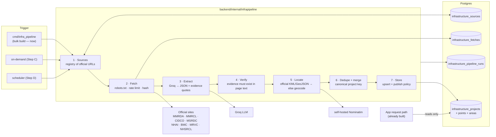
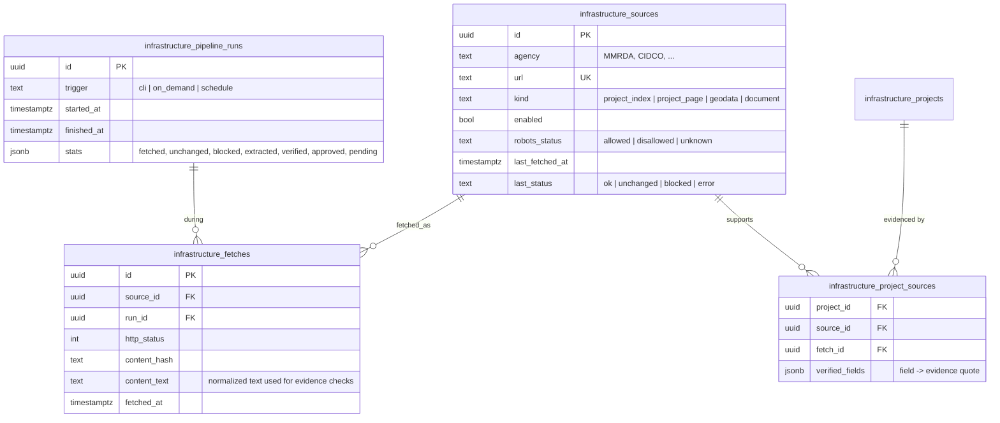

# Planned Infrastructure — Data Pipeline Plan (Step A + B: "build the database first")

Owner: Mayur · Implementers: Claude (this repo session) + Codex · Written 2026-09-26
Related: [README](README.md) · [ADR-0007](../../docs/adr/0007-planned-infrastructure-shared-verified-list-and-distance-matching.md) · [ADR-0006](../../docs/adr/0006-location-search-separated-from-valuation-model.md)

## 1. Goal

Before launch, fill the database with the planned infrastructure of the **Mumbai Metropolitan
Region (MMR)** from official agencies, using a pipeline that is **part of the backend** — so that
after deploy nobody (and no AI assistant) needs to edit the code folder or run `curl` by hand.
At request time the app reads only its own database.

Out of scope for this plan (later steps): on-demand fetch for uncovered areas + coverage record
(Step C), scheduled refresh (Step D), review screen UI (phase 3).

## 2. Key design decisions

1. **Collect by project, not by location.** MMR has roughly 100–300 relevant projects; locations
   are unlimited. Store each project with its station/route coordinates; distance matching then
   answers every location (Bandra, Raunak City, an unnamed plot) automatically.
2. **Pipeline = Go code in `backend/`**, one set of stages with several triggers: a CLI command
   now (bulk build), user-triggered and scheduled later. Output goes to the database only.
3. **Every extracted fact carries evidence.** The extractor must return, for each field, the
   exact sentence from the fetched page that supports it. The pipeline checks that sentence
   really exists in the stored page text; a field whose evidence isn't found is dropped. This is
   the main defence against AI-invented dates or stations.
4. **Raw pages are stored.** Every fetch is saved (text + hash) so extraction can be re-run and
   audited without re-fetching, and unchanged pages are skipped.
5. **Publish policy (default — confirm):** a project is auto-approved only when every published
   field passed evidence verification *and* its points come from an official geodata file;
   everything else is `pending` for human review. Configurable via `INFRA_PUBLISH_POLICY`
   (`strict` = all pending, `evidence` = default above, `auto` = approve everything verified).
6. **UI shows** `source: <agency> · updated <date>`. Who/what verified it stays in the database
   (`verified_by`, e.g. `pipeline v1` or a reviewer's name) and is not shown to end users.
7. **Polite, compliant fetching:** public official pages only; check and obey `robots.txt`;
   identify the app in the User-Agent (no personal email); ≤ 1 request / 5 s per domain; stop on
   403/429/challenge pages and record the block — never work around it.
8. **Bulk geocoding needs our own geocoder.** The public Nominatim service forbids bulk use, and
   the bulk build will geocode hundreds–thousands of station names. Run a **self-hosted
   Nominatim** (Docker, OpenStreetMap western-India extract) for the pipeline. Free, no limits.

## 3. Architecture



### Stage contracts

| # | Stage | Input → Output | Notes |
|---|---|---|---|
| 1 | Sources | registry rows → list of URLs to process | kinds: `project_index` (lists projects), `project_page`, `geodata` (KML/KMZ/GeoJSON), `document` (PDF, v2) |
| 2 | Fetch | URL → stored snapshot (`status`, `content_hash`, extracted text) | skip if hash unchanged; record `blocked` on 403/429/challenge |
| 3 | Extract | page text → `[]ExtractedProject` | index pages also yield new `project_page` URLs to add to the registry |
| 4 | Verify | extracted fields + page text → verified fields only | exact-substring check on normalized text; per-field pass/fail stored |
| 5 | Locate | stations → points with `coord_source` | geodata file → `official_file`; else geocode "station, locality, Mumbai" → `approximate`, rejected if outside the MMR box or > 15 km from the project's other points |
| 6 | Dedupe | candidates → canonical projects | key = agency + normalized name; merge fields, keep every source |
| 7 | Store | canonical projects → DB rows | upsert; apply publish policy; never overwrite a human-edited field (`locked_fields`) |

### Extraction output (per project) — the contract between stage 3 and 4

```json
{
  "name": "Metro Line 12 (Kalyan–Taloja)",
  "kind": "metro",
  "status": {"value": "under_construction", "evidence": "Pile Works 37.12% completed"},
  "expected_completion": {"value": null, "evidence": null},
  "length_km": {"value": 23.57, "evidence": "Length: 23.57 Km (Fully Elevated)"},
  "stations": [{"name": "Kalyan APMC", "evidence": "…"}],
  "localities": [{"name": "Dombivli MIDC", "evidence": "…"}],
  "description": "short neutral summary built only from verified fields"
}
```

Rule for the model: if the page doesn't state it, return `null` — never infer dates.

## 4. Data model changes (migration 000030)



Also: `infrastructure_projects` gains `agency TEXT`, `canonical_key TEXT UNIQUE`,
`locked_fields TEXT[]` (fields a human edited — pipeline won't overwrite).

## 5. Initial source list (MMR) — to be researched and confirmed in Task C1

Agencies and example project families. **URLs and statuses must be confirmed from the live
official sites; nothing here is asserted as fact.**

| Agency | Project families to look for |
|---|---|
| MMRDA | Metro Lines 2B, 4, 4A, 5, 6, 7A, 9, 10, 11, 12, 13, 14; elevated roads; Thane–Borivali twin tunnel; Orange Gate–Marine Drive tunnel; MTHL links |
| MMRCL | Metro Line 3 (Colaba–Bandra–SEEPZ) |
| CIDCO | Navi Mumbai Metro lines; Navi Mumbai International Airport; related road links |
| MSRDC | Versova–Bandra sea link; Mumbai–Pune missing link; Virar–Alibaug multimodal corridor |
| NHAI | Expressways/highways crossing MMR (e.g. Mumbai–Vadodara) |
| BMC | Coastal road extensions; Goregaon–Mulund link road |
| MRVC | MUTP suburban rail lines and new corridors |
| NHSRCL | Mumbai–Ahmedabad high-speed rail stations in MMR |

## 6. Task breakdown

Legend: **[Claude]** = done in this session · **[Codex]** = prompt Codex (prompts in §8) ·
**[Mayur]** = needs you.

### Milestone M0 — clean up what exists (½ day)
- **T0.1 [Claude]** UI: show `source · updated <date>`, drop `verified_by` from the screen.
- **T0.2 [Claude]** Re-label existing seed rows `verified_by = 'manual seed (2026-09-26)'`.

### Milestone M1 — foundations (2–3 days)
- **T1.1 [Claude]** Migration 000030 (tables in §4) + domain types + stage interfaces in
  `backend/internal/infrapipeline/` (`Source`, `Fetcher`, `Extractor`, `Verifier`, `Locator`,
  `Store`) so Codex tasks can be built against fixed interfaces.
- **T1.2 [Codex]** `infrapipeline/fetch`: HTTP fetcher with robots.txt, per-domain rate limit,
  User-Agent, HTML→text normalization, content hash, block detection. Unit tests with
  `httptest` servers.
- **T1.3 [Codex]** `infrapipeline/geodata`: KML + KMZ + GeoJSON parser → station/route points.
  Tests using the real MMRDA Metro Line 5 KML (17 stations; values are in
  `backend/seeds/infrastructure_projects.sql`).
- **T1.4 [Codex]** Self-hosted Nominatim: `docker-compose` service (western-India extract),
  startup docs in `docs/`, and a `geo.NominatimGeocoder` base-URL option pointing at it.

### Milestone M2 — extraction you can trust (2–3 days)
- **T2.1 [Claude]** `infrapipeline/extract`: Groq extractor with the JSON contract in §3
  (structured output, temperature 0, "null if not stated").
- **T2.2 [Claude]** `infrapipeline/verify`: evidence verification (normalized substring match),
  per-field results, and the publish policy.
- **T2.3 [Mayur + Claude]** **Gold set:** 15 projects checked by you against official pages
  (name, status, date-if-stated, station list). Stored as `testdata/gold/*.json`.
- **T2.4 [Claude]** Evaluation command: runs extract+verify on the gold pages and reports field
  precision, "invented field" rate, and location error vs official KML. **Gate for M4:**
  0 invented dates, ≥ 95 % field precision on verified fields, median station error < 500 m for
  `approximate` points.

### Milestone M3 — sources (can run in parallel with M1–M2)
- **T3.1 [Codex]** Research task: compile the MMR source registry (§5) as
  `backend/seeds/infrastructure_sources.sql` — agency, URL, kind, and the `robots.txt` result for
  each domain. No scraping of content in this task; just the list and robots checks.
- **T3.2 [Mayur]** Skim T3.1's list: remove anything that isn't an official agency page.

### Milestone M4 — orchestrate and run the bulk build (2 days)
- **T4.1 [Claude]** Orchestrator + locate + dedupe + store; `cmd/infra_pipeline` with flags
  `--agency`, `--source`, `--dry-run`, `--policy`; run stats saved to `infrastructure_pipeline_runs`.
- **T4.2 [Claude]** Dry run on MMRDA only → review output with you → fix → full MMR run.
- **T4.3 [Mayur]** Review the `pending` queue (SQL/CLI list until the review screen exists).
- **T4.4 [Claude]** Update README coverage table and ADR-0007 consequences with real numbers.

## 7. Acceptance criteria for "database built"

- [ ] `cmd/infra_pipeline` runs end to end with no manual steps and is idempotent (second run:
      mostly `unchanged`, no duplicates).
- [ ] Every approved project has ≥ 1 source with stored evidence for each shown field.
- [ ] Gold-set gate from T2.4 passed.
- [ ] Blocked/disallowed sources are recorded, not bypassed.
- [ ] "Bandra", "Andheri East", "Vashi", "Thane West", "Panvel", "Raunak City" each return at least
      one nearby project from the database, with no web access at request time.
- [ ] README + ADR updated; run stats reported.

## 8. Ready-to-paste Codex prompts

Give Codex one task at a time. Each prompt assumes Codex has read this file.

### Prompt for T1.2 — Fetcher

```
Read services/plannedinfrastructure/PIPELINE_PLAN.md (sections 2, 3 and task T1.2).
Implement backend/internal/infrapipeline/fetch in Go: a type that satisfies
infrapipeline.Fetcher (backend/internal/infrapipeline/pipeline.go) and returns
infrapipeline.FetchResult with every field filled. Read the doc comments on those types first —
they are the contract. Add `var _ infrapipeline.Fetcher = (*Fetcher)(nil)` to prove it.

Requirements:
- GET a URL and return: final URL, HTTP status, Raw bytes, normalized Text (HTML tags/scripts/
  styles/nav removed, whitespace collapsed; for non-HTML types leave Text empty), sha256 hex of
  Raw as ContentHash, ContentType, FetchedAt, and Status ok | blocked | error with a Detail.
- Return a non-nil error only for ctx cancellation; network/HTTP failures go in Status/Detail.
- Obey robots.txt per domain (cache it per run); if disallowed, return blocked without fetching.
- Rate limit: at most 1 request per 5 seconds per domain; safe for concurrent callers.
- User-Agent: "ScridddHub-InfraPipeline/1.0 (+https://scridddhub.example/bot)". No email.
- Treat 403, 429, and pages that look like bot challenges as blocked. Do not retry around them,
  do not rotate user agents, proxies or headers.
- Unit tests with net/http/httptest: robots allow/deny, rate limit timing, 403 -> blocked,
  HTML normalization, identical content -> identical hash.
Do not modify files outside backend/internal/infrapipeline/fetch and its tests.
Run: cd backend && go build ./... && go test ./internal/infrapipeline/...
```

### Prompt for T1.3 — Geodata parser

```
Read services/plannedinfrastructure/PIPELINE_PLAN.md (task T1.3).
Implement backend/internal/infrapipeline/geodata in Go: a type satisfying
infrapipeline.GeodataParser (backend/internal/infrapipeline/pipeline.go) that parses KML, KMZ
(zipped KML) and GeoJSON into []infrapipeline.GeoPoint {Label, Kind (PointStation|PointRoute),
Latitude, Longitude}. Add `var _ infrapipeline.GeodataParser = (*Parser)(nil)`.
- KML Placemark with Point -> station; LineString/MultiGeometry lines -> route points.
- Clean labels like "Bhiwandi(M) Statiion" -> "Bhiwandi" (strip "(M)", "Station"/typos).
- Coordinates in KML are lon,lat[,alt] — keep lat/lng the right way round.
Tests: download is NOT allowed in tests — add a trimmed copy of the MMRDA Metro Line 5 KML
(https://mmrda.maharashtra.gov.in/sites/default/files/2025-03/metro_line-5.kml) under testdata/
and assert 17 stations, and that "APMC Kalyan" is at 19.235337, 73.122788 (±1e-6).
Only touch backend/internal/infrapipeline/geodata and its testdata.
Run: cd backend && go test ./internal/infrapipeline/geodata/...
```

### Prompt for T1.4 — Self-hosted Nominatim

```
Read services/plannedinfrastructure/PIPELINE_PLAN.md (decision 8 and task T1.4).
Add a self-hosted Nominatim for bulk geocoding:
- docker-compose service "nominatim" (use the maintained mediagis/nominatim image), importing the
  Geofabrik "western-zone" India extract, persistent volume, port 8088, not started by default
  (compose profile "geo").
- docs/self-hosted-nominatim.md: first-time import command, expected import time/disk, how to
  check it's ready, how to point the backend at it.
- In backend/internal/geo/nominatim.go add NewNominatimGeocoderWithBaseURL(baseURL string);
  when the base URL is not the public nominatim.openstreetmap.org, skip the 1 req/s wait.
  Keep NewNominatimGeocoder() behaviour unchanged.
Do not change any other backend code. Run: cd backend && go build ./...
```

### Prompt for T3.1 — Source registry research

```
Read services/plannedinfrastructure/PIPELINE_PLAN.md (sections 2, 5 and task T3.1).
Build backend/seeds/infrastructure_sources.sql: an idempotent INSERT ... ON CONFLICT (url)
of official source pages for planned/under-construction infrastructure in the Mumbai
Metropolitan Region, for these agencies: MMRDA, MMRCL, CIDCO, MSRDC, NHAI, BMC, MRVC, NHSRCL.
Columns: agency, url, kind (project_index | project_page | geodata | document), enabled,
robots_status (allowed | disallowed | unknown).
Rules:
- Official agency domains only (e.g. *.gov.in, the agency's own domain). No news sites, no
  property portals, no Wikipedia.
- Fetch each domain's robots.txt once and record the result per URL. If a path is disallowed,
  still list it with robots_status = 'disallowed' and enabled = false.
- Don't bypass blocks: if a site returns 403/challenge, record it as unknown/disabled and move on.
- Include every geodata file (KML/KMZ/GeoJSON) you find, e.g. the known MMRDA Metro Line 5 KML.
- Add a comment block at the top listing, per agency, what you checked and what you couldn't
  reach.
Write a short report codex/INFRA_SOURCES_REPORT_<date>.md: counts per agency and kind, blocked
domains, and gaps.
```

## 9. Risks

| Risk | Mitigation |
|---|---|
| AI invents dates/stations | evidence-quote verification (decision 3) + gold-set gate |
| Agency sites block automated access | record `blocked`; fall back to manual entry for those projects — never bypass |
| Key facts only in PDFs (DPRs) | v1 covers HTML + geodata; PDF text extraction is a v2 task |
| Under-construction stations not in OpenStreetMap | geocode by locality → `approximate`, flagged; fix in review (`manual`) |
| Same project on several sites with different numbers | dedupe by canonical key, keep all sources, prefer the implementing agency's own page |
| Groq cost/limits during bulk run | skip unchanged pages by hash; extract only changed pages |
