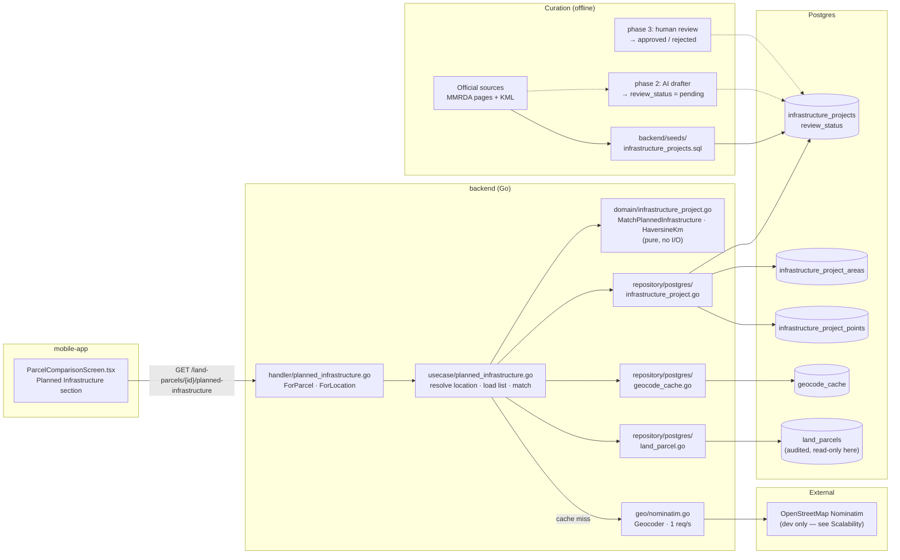
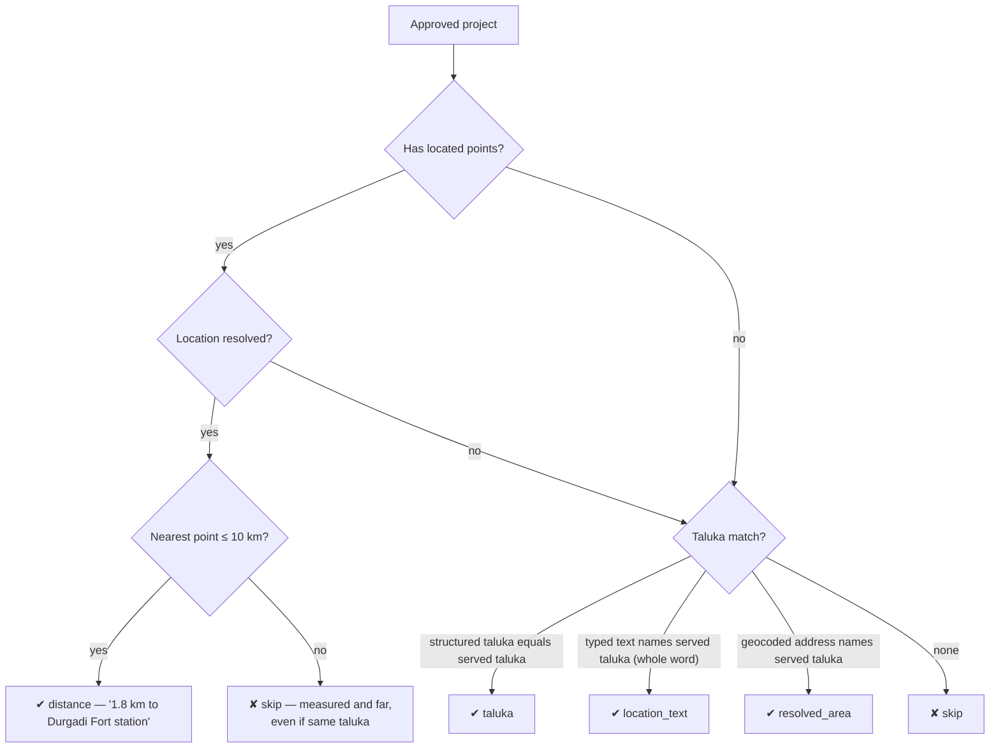
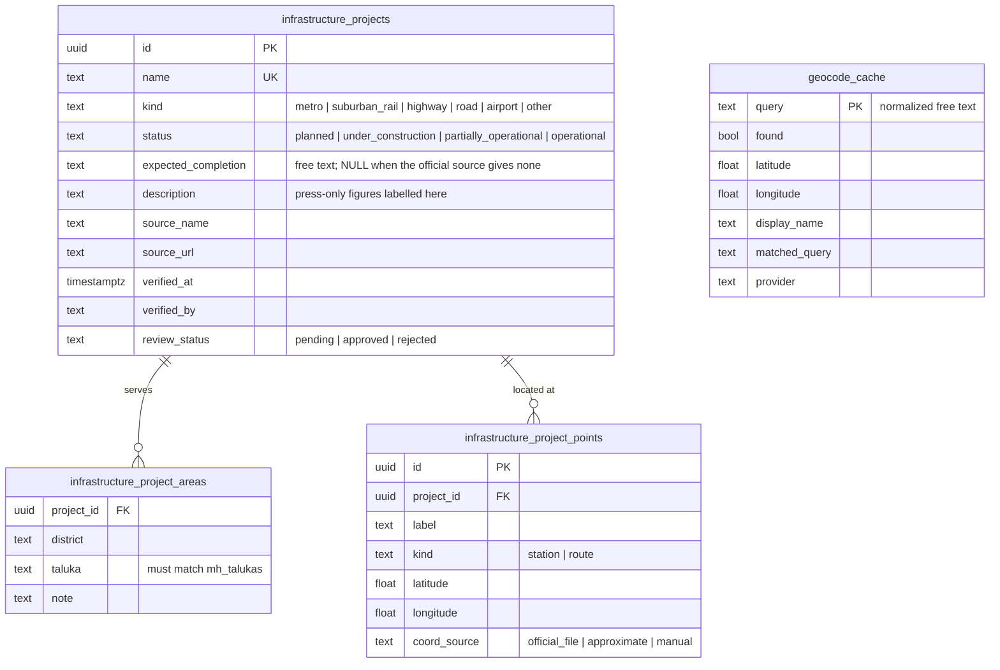

# Planned Infrastructure (Screen 5)

Answers: **"For this property, what new infrastructure is coming nearby?"** — for a saved parcel or
any typed location. Decision record: [ADR-0007](../../docs/adr/0007-planned-infrastructure-shared-verified-list-and-distance-matching.md)
(builds on [ADR-0006](../../docs/adr/0006-location-search-separated-from-valuation-model.md):
locations are resolved by geocoding, not name matching).

**Getting it running:** [RUNBOOK.md](RUNBOOK.md) — setup, daily startup, commands, schedule,
limits, troubleshooting. **Approving projects:** [REVIEW_GUIDE.md](REVIEW_GUIDE.md).

**Status (2026-09-27):** distance matching, source pipeline (Step B, MMRDA), on-demand search for
uncovered areas via Exa (Step C) and a daily 1 PM scheduled run (Step D) are built and running.
Next: more agencies, a review screen in the app. See PIPELINE_PLAN.md "Status".

## Architecture



## Request flow

```mermaid
sequenceDiagram
    participant App as Mobile app
    participant H as Handler
    participant U as Usecase
    participant C as geocode_cache
    participant N as Nominatim
    participant L as Project list (approved)
    participant D as Domain match

    App->>H: GET /reference/planned-infrastructure?location=Raunak City
    H->>U: ForLocation("Raunak City")
    U->>C: Get("raunak city")
    alt cached
        C-->>U: point + display name (or cached miss)
    else not cached
        U->>N: "Raunak City, Maharashtra"
        N-->>U: not found?
        Note over U,N: drop leading parts and retry<br/>("Godrej Hill, Khadakpada" → "Khadakpada")
        N-->>U: 19.24, 73.12 · "Raunak City, Aadharwadi, Kalyan…"
        U->>C: Put (hits and misses; never transient errors)
    end
    U->>L: ListApproved()
    L-->>U: projects + areas + points
    U->>D: Match(place, point, resolved address, projects, 10 km)
    D-->>U: distance matches (nearest first), then taluka matches
    U-->>App: location understood as… + items
    Note over App: shows "Exact place not found — measured from X"<br/>when only part of the text matched
```

## Matching rules



## Data model



## Where the code lives

The backend follows the repo-wide layering (every entity is split the same way:
`domain → usecase → handler`, with `repository/postgres` behind usecase-owned interfaces), so this
feature's files sit in those shared folders rather than one feature folder. This table is the map:

| Layer | File | Responsibility |
|---|---|---|
| Migration | `backend/migrations/000028_create_infrastructure_projects.*.sql` | projects + served areas |
| Migration | `backend/migrations/000029_infrastructure_points_review_and_geocode_cache.*.sql` | points, review gate, geocode cache |
| Seed | `backend/seeds/infrastructure_projects.sql` | the verified list (idempotent; re-run after edits) |
| Domain | `backend/internal/domain/infrastructure_project.go` | types, `MatchPlannedInfrastructure`, `HaversineKm` — pure logic |
| Domain tests | `backend/internal/domain/infrastructure_project_test.go` | matching rules with real MMRDA coordinates |
| Usecase | `backend/internal/usecase/planned_infrastructure.go` | `ForLocation`, `ForParcel`, geocode + fallback + cache |
| Usecase tests | `backend/internal/usecase/planned_infrastructure_test.go` | fallback, cached misses, outage degrades |
| Geocoder | `backend/internal/geo/nominatim.go` | `usecase.Geocoder` implementation (swap for prod) |
| Repositories | `backend/internal/repository/postgres/infrastructure_project.go`, `geocode_cache.go` | reads approved list; cache get/put |
| Handler | `backend/internal/handler/planned_infrastructure.go` | HTTP ↔ usecase |
| Routes | `backend/cmd/server/main.go` | wiring + the two routes below |
| API contract | `backend/api/openapi.yaml` (`PlannedInfrastructureList`, `PlannedInfrastructureItem`) | regenerate `packages/api-client` after edits |
| Mobile | `mobile-app/src/screens/ParcelComparisonScreen.tsx` | "Planned Infrastructure" section |

**Endpoints**

- `GET /land-parcels/{parcelID}/planned-infrastructure` — for a saved parcel
- `GET /reference/planned-infrastructure?location=…[&district=…&taluka=…]` — for any typed location

## Adding a project to the list

1. Find the **official** page (MMRDA, CIDCO, MSRDC, NHAI, MahaMetro…). Every fact you enter must be
   on that page. Press-only dates go in `description`, labelled "press reports".
2. Add it to `backend/seeds/infrastructure_projects.sql`: project row, served talukas (names must
   match `mh_talukas`), and station points if coordinates exist (`official_file` from the agency's
   KML; `manual` if you placed them from a map).
3. Set `verified_at` and `verified_by` to when and who actually checked it.
4. Apply: `docker exec -i scridddhubconstructionsoftware-postgres-1 psql -U scridddhub -d scridddhub < backend/seeds/infrastructure_projects.sql`

## Current coverage (honest)

| Project | Points | Verified |
|---|---|---|
| Metro Line 5 (Thane–Bhiwandi–Kalyan) | 17 stations, `official_file` (MMRDA KML) | by Claude (AI), pending human review |
| Metro Line 12 (Kalyan–Taloja) | none — MMRDA publishes no geodata; taluka matching only | by Claude (AI), pending human review |

Test results (2026-09-26): "Raunak City" → Raunak City, Aadharwadi, Kalyan → Metro Line 5 1.8 km
(Durgadi Fort). "Andheri East" and "Baner, Pune" resolve correctly but show nothing — real projects
exist there, they're just not on the list yet. "Xyzzy Plot 99" → unresolved, taluka-only matching.

## Scalability

Fine for the MVP and MMR-scale list (hundreds of projects, low thousands of points). Known limits,
in the order they'll bite:

| Limit | Why | Fix when needed |
|---|---|---|
| **Geocoder throughput** — public Nominatim, 1 req/s, one global mutex, called inside the GET on a cache miss (first view 1–3 s) | usage policy; dev-only | production provider behind the existing `usecase.Geocoder` interface (ADR-0006 open decision: Google/Mappls paid, or self-hosted Nominatim); geocode when a parcel is created/edited instead of on first view |
| **Whole list loaded per request**, matched in Go | simplest correct thing at this size | cache the approved list in memory (it changes only on review); beyond ~50k points move to PostGIS (`geography` column + GiST index, `ST_DWithin` / KNN `<->`) |
| **Stations only, no route lines** | a highway/ring road has no "stations" | store route vertices (`kind = 'route'`) or a PostGIS `LINESTRING`, distance-to-line |
| **Straight-line distance** | no routing engine | label stays explicit; road distance would need a routing service (OSRM/Google) |
| **Cache has no expiry** | places rarely move | add a TTL/refresh if the provider changes |
| **Curation is the real bottleneck** | coverage = approved list size | phase 2 (AI drafts as `pending`) + phase 3 (review screen) |

Swapping the geocoder, caching the list, or moving matching to PostGIS are all contained changes:
the domain function and the usecase interfaces are the seams.
