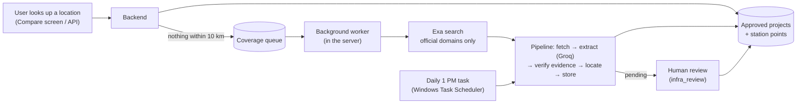

# Planned Infrastructure — Runbook

How to get the Planned Infrastructure feature running from scratch, keep it fed with data, and fix
it when something breaks. For *why* it's built this way see [README.md](README.md) and
[ADR-0007](../../docs/adr/0007-planned-infrastructure-shared-verified-list-and-distance-matching.md);
for the build plan see [PIPELINE_PLAN.md](PIPELINE_PLAN.md); for approving projects see
[REVIEW_GUIDE.md](REVIEW_GUIDE.md).

All paths are relative to `scridddhubconstructionsoftware/`. Commands are for Windows (Git Bash or
PowerShell) on the dev laptop.

---

## 1. What it does, in one picture



- **Step B** — the database is filled from registered official sources (MMRDA so far).
- **Step C** — a lookup with nothing measured within 10 km queues its ~5 km area; a background
  worker searches official sites (Exa) and runs the pipeline on what it finds.
- **Step D** — a daily scheduled run searches queued areas, then re-checks every source.
- New projects land as **pending** and only appear in the app once **approved**.

---

## 2. One-time setup

### 2.1 Prerequisites
- Docker Desktop (not on PATH on this laptop — full path:
  `%LOCALAPPDATA%\Programs\DockerDesktop\resources\bin\docker.exe`)
- Go (1.25+), Node.js, Android SDK + emulator `Pixel_8_Pro`

### 2.2 Keys in `backend/.env`
`backend/.env` is git-ignored — never commit it or paste keys into chats/issues.

| Variable | Needed for | Where to get it |
|---|---|---|
| `GROQ_API_KEY` | page extraction (and Estimate Value) | console.groq.com → API Keys |
| `EXA_API_KEY` | Step C: finding official pages for an uncovered area | dashboard.exa.ai → API Keys |
| `NOMINATIM_URL` | *optional* — self-hosted geocoder for bulk runs | see `docs/self-hosted-nominatim.md` |
| `INFRA_PUBLISH_POLICY` | *optional* — `strict` / `evidence` (default) / `auto` | — |
| `INFRA_ONDEMAND` | *optional* — `off` = only queue areas, don't search from the server | — |
| `OSM_NEARBY` | *optional* — `off` = don't show existing schools/hospitals/hazards from OpenStreetMap | — |
| `OVERPASS_URLS` | *optional* — comma-separated Overpass endpoints (default: overpass-api.de only) | a self-hosted Overpass before launch |

Without `EXA_API_KEY`, discovery falls back to Groq's browser search, which failed repeatedly
when tested (2026-09-27) — set the Exa key.

### 2.3 Database: migrations and seeds
```bash
docker compose up -d postgres
docker compose run --rm migrate up          # applies migrations up to 000035
docker exec -i scridddhubconstructionsoftware-postgres-1 psql -U scridddhub -d scridddhub < backend/seeds/infrastructure_projects.sql
docker exec -i scridddhubconstructionsoftware-postgres-1 psql -U scridddhub -d scridddhub < backend/seeds/infrastructure_sources.sql
docker exec -i scridddhubconstructionsoftware-postgres-1 psql -U scridddhub -d scridddhub < backend/seeds/infrastructure_sources_more_agencies.sql
```
Without the Docker CLI on PATH, migrations also run with golang-migrate directly (from `backend/`):
`go run -tags postgres github.com/golang-migrate/migrate/v4/cmd/migrate@v4.18.1 -path migrations -database "$DATABASE_URL" up`

Migrations for this feature: 000028 (projects), 000029 (points, review gate, geocode cache),
000030 (pipeline tables), 000031 (unknown status, project hints), 000032 (coverage queue,
official-domain allowlist), 000033 (six categories, 33 kinds), 000034 (OpenStreetMap place
cache), 000035 (jobs group, MIDC/MSETCL domains).

**Two kinds of data on the screen.** *Planned* projects (this pipeline, reviewed, official
sources) and *existing* places (schools, hospitals, industrial areas, substations, landfills,
sewage plants, power lines) looked up live from OpenStreetMap, cached per ~1 km cell for 30 days.
The first lookup of a new area waits up to 12 s for OpenStreetMap; if the public server is busy
(it often returns 504), the rest fills in on a later lookup — nothing to do.

### 2.4 First fill of the database (Step B)
```bash
cd backend
go run ./cmd/infra_pipeline --agency MMRDA --dry-run   # look first — writes nothing
go run ./cmd/infra_pipeline --agency MMRDA             # store (new projects arrive as pending)
```
Then review the pending projects — [REVIEW_GUIDE.md](REVIEW_GUIDE.md).

### 2.5 Turn on the daily run (Step D)
```powershell
powershell -ExecutionPolicy Bypass -File scripts\register_infra_schedule.ps1 -Frequency Daily -At 13:00
```
Currently registered: **daily at 1 PM, up to 2 hours per run**. Switch to weekly later:
```powershell
powershell -ExecutionPolicy Bypass -File scripts\register_infra_schedule.ps1 -Frequency Weekly -Day Sunday -At 13:00
```
Remove: `Unregister-ScheduledTask -TaskName "ScridddHub infra pipeline" -Confirm:$false`

---

## 3. Every day: starting the app

1. Start Docker Desktop; wait until `docker ps` works. It's installed per-user, so if `docker`
   isn't found, launch `%LOCALAPPDATA%\Programs\DockerDesktop\Docker Desktop.exe` (the CLI is in
   `...\resources\bin`). Let Docker finish starting **before** the emulator: starting both at
   once crashed the emulator ("WHPX: Unexpected VP exit code 4"). If that happens, force-stop it
   and cold-boot with `-no-snapshot-load`.
2. `docker compose up -d postgres`
3. Backend: `cd backend && go run ./cmd/server` — wait for `listening on :8080`.
   The Step C background worker starts with it.
4. Emulator: `emulator -avd Pixel_8_Pro -scale 0.7`, then **move the window on-screen** (it often
   opens off-screen — PowerShell fix in `docs/android-emulator-troubleshooting.md`).
5. Metro: `cd mobile-app && npx react-native start` — wait for "Welcome to Metro".
6. `adb reverse tcp:8081 tcp:8081`
7. Fresh launch: `adb shell pm clear com.scridddhub.mobileapp` then
   `adb shell am start -n com.scridddhub.mobileapp/.MainActivity`
   (`pm clear` matters: the debug app otherwise reuses a stale JS bundle.)

Full startup detail: `docs/launching-the-app.md`, `docs/starting-the-backend.md`.

---

## 4. Commands you'll use

All from `backend/`.

| Goal | Command |
|---|---|
| See what a run would store | `go run ./cmd/infra_pipeline --agency MMRDA --dry-run` |
| Real run for one agency | `go run ./cmd/infra_pipeline --agency MMRDA` |
| Re-read pages even if unchanged | add `--force` |
| One source only | `go run ./cmd/infra_pipeline --source "<registered url>"` |
| What the scheduled task does | `go run ./cmd/infra_pipeline --scheduled --max-duration 2h` |
| Search queued areas only | `go run ./cmd/infra_pipeline --process-coverage 5` |
| List pending projects | `go run ./cmd/infra_review list` |
| Check a project's points | `go run ./cmd/infra_review points "mmrda:metro line 4"` |
| Remove a wrong point | `go run ./cmd/infra_review drop-point "<key>" "<label>"` |
| Approve / reject / undo | `go run ./cmd/infra_review approve\|reject\|reopen "<key>" --by "Your Name"` |
| Run the scheduled job now | `powershell -ExecutionPolicy Bypass -File ..\scripts\run_infra_pipeline.ps1 -MaxDuration 30m` |

Try the API directly:
```bash
curl -G http://localhost:8080/reference/planned-infrastructure --data-urlencode "location=Raunak City"
```

---

## 5. Adding a new agency (growing Step B)

1. Find the agency's **official** project pages (its own domain or `*.gov.in`).
2. Check its `robots.txt` allows them. If a path is disallowed, don't register it.
3. Add rows to `backend/seeds/infrastructure_sources_more_agencies.sql` — one per project page,
   with `project_hint` (the project's name) so name variations don't create duplicates. Add any
   official KML/GeoJSON as `kind = 'geodata'` with the same `project_hint`. If the agency has a
   projects *listing*, register that as `kind = 'project_index'` instead and add a link rule for
   its URL pattern in `llm.linkRules` (`backend/internal/llm/groq_infra_extractor.go`) — MSRDC's is
   the example (keeps its `?ID=` parameter, crawls sub-lists one level).
   Check a page's readable text first: if it's only menus (content in a PDF, or rendered by
   JavaScript), the pipeline can't use it — note it in the seed file as not registered.
4. If its domain isn't in `infrastructure_official_domains` (migration 000032), add it there too
   so Step C discovery accepts pages from it.
5. Apply the seed, dry-run that agency, run it, review.

---

## 6. Limits to know about

| Limit | Effect | What to do |
|---|---|---|
| Groq free tier: **200k tokens/day** (gpt-oss-120b) | ~50–60 page extractions a day; runs stop cleanly when it's used up and continue next run | Unchanged pages are skipped automatically; upgrade Groq's tier if more is needed |
| Groq free tier: 8k tokens/minute | extraction pauses and retries automatically | nothing |
| Exa: pay-per-search (~$0.012 each, free monthly credit) | only used for areas nobody has covered | watch usage in the Exa dashboard |
| Public geocoder: 1 req/s, no bulk | pipeline caps itself at 300 lookups/run | self-host Nominatim before launch (`docs/self-hosted-nominatim.md`) |
| Scheduled task needs the laptop on | a missed 1 PM run starts when the laptop is next on | — |
| PDFs aren't read yet | PDF results from search are skipped | planned v2 |
| Public Overpass (OpenStreetMap): shared, often busy | an area's schools/hospitals may take a few lookups to appear | self-host Overpass before launch (`OVERPASS_URLS`) |
| OpenStreetMap completeness varies | e.g. Kalyan has many hospitals mapped but few schools | shown as "Source: OpenStreetMap"; not reviewed data |

---

## 7. Troubleshooting

| Symptom | Likely cause | Fix |
|---|---|---|
| App shows a blank white screen | stale Metro / JS bundle | restart Metro, `adb reverse tcp:8081 tcp:8081`, `pm clear`, relaunch |
| Emulator "running" but invisible | window placed off-screen | PowerShell `SetWindowPos` fix in `docs/android-emulator-troubleshooting.md` |
| "Could not load infrastructure" | backend down or DB down | check `docker ps`, restart backend |
| Backend logs `failed to connect to the docker API` | Docker Desktop stopped (power cut / restart) | launch Docker Desktop, `docker compose up -d postgres` |
| Run log: `groq daily token quota reached` | free-tier daily cap used up | nothing — next run continues |
| Run log: `BLOCKED … disallowed by robots.txt` / `bot-challenge` | the site doesn't allow automated access to that page | expected; it's recorded, never bypassed |
| Area stuck "searching" in `infrastructure_coverage` | server stopped mid-search | it's re-queued on the next lookup; or `--process-coverage` |
| A project shows a wrong distance | a wrongly geocoded point | `infra_review points` → `drop-point` |
| Scheduled run didn't happen | laptop off / task missing | `Get-ScheduledTask -TaskName "ScridddHub infra pipeline" \| Get-ScheduledTaskInfo`; logs in `logs/infra_pipeline/` |

Useful SQL (`docker exec -it scridddhubconstructionsoftware-postgres-1 psql -U scridddhub -d scridddhub`):
```sql
SELECT review_status, count(*) FROM infrastructure_projects GROUP BY 1;          -- approved/pending/rejected
SELECT cell, place_name, status, sources_found, last_error FROM infrastructure_coverage;  -- Step C queue
SELECT started_at, trigger, stats, error FROM infrastructure_pipeline_runs ORDER BY started_at DESC LIMIT 5;
```

---

## 8. Where the code is

| Piece | Location |
|---|---|
| Stage interfaces + runner | `backend/internal/infrapipeline/` (`pipeline.go`, `run.go`, `discover.go`, `worker.go`, `policy.go`, `canonical.go`) |
| Fetcher (robots.txt, rate limit) | `backend/internal/infrapipeline/fetch/` |
| KML/GeoJSON parser | `backend/internal/infrapipeline/geodata/` |
| Evidence checker | `backend/internal/infrapipeline/verify/` |
| Station locator | `backend/internal/infrapipeline/locate/` |
| Wiring (server + CLI share it) | `backend/internal/infrapipeline/setup/` |
| Groq extractor / Groq search fallback | `backend/internal/llm/groq_infra_extractor.go`, `groq_area_discoverer.go` |
| Exa search | `backend/internal/search/exa.go` |
| Database access | `backend/internal/repository/postgres/infra_pipeline_store.go`, `infra_coverage.go`, `infrastructure_project.go`, `geocode_cache.go` |
| Matching + API | `backend/internal/domain/infrastructure_project.go`, `usecase/planned_infrastructure.go`, `handler/planned_infrastructure.go` |
| Commands | `backend/cmd/infra_pipeline`, `backend/cmd/infra_review` |
| Scheduled task scripts | `scripts/run_infra_pipeline.ps1`, `scripts/register_infra_schedule.ps1` |
| App screen | `mobile-app/src/screens/ParcelComparisonScreen.tsx` |
